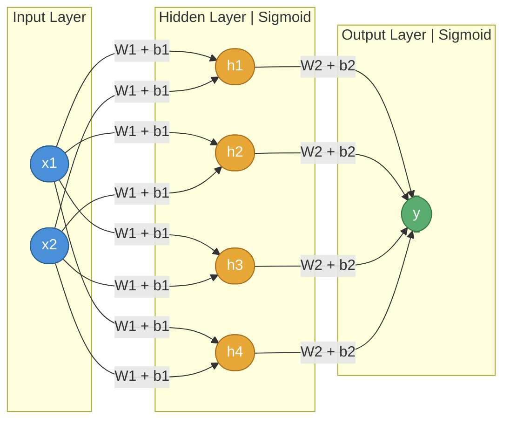

# Simple Neural Network from Scratch

A minimal implementation of a neural network with one hidden layer, designed to solve the XOR problem using only NumPy.

## Architecture



| Layer | Neurons | Weights | Bias | Activation |
|-------|---------|---------|------|------------|
| Input | 2 | - | - | None |
| Hidden | 4 | W1 (2x4) | b1 | Sigmoid |
| Output | 1 | W2 (4x1) | b2 | Sigmoid |

- Loss Function: Mean Squared Error (MSE)
- Optimization: Gradient Descent with backpropagation

## XOR Problem

The XOR function is not linearly separable, requiring at least one hidden layer to solve.

| x1 | x2 | y |
|----|----|---|
| 0  | 0  | 0 |
| 0  | 1  | 1 |
| 1  | 0  | 1 |
| 1  | 1  | 0 |

## Practical Applications

This architecture — a small fully connected network with sigmoid activations — is suited for low-dimensional binary classification tasks where inputs are structured and the dataset is small.

| Use Case | Inputs | Output |
|----------|--------|--------|
| Spam detection | Word frequency features | Spam / Not spam |
| Disease diagnosis | Patient vitals (e.g. age, blood pressure) | At risk / Not at risk |
| Fault detection | Sensor readings from a machine | Fault / Normal |
| Credit approval | Income, debt ratio | Approve / Reject |
| Gate simulation | Logic signal pairs | Binary output (AND, OR, XOR, NAND) |
| Student pass/fail prediction | Attendance, test scores | Pass / Fail |

### Why this architecture fits these problems

- The inputs are small in number (2 to ~10 features), matching the 2-input design
- The output is binary (0 or 1), matching the single sigmoid output neuron
- The hidden layer with sigmoid activation can learn non-linear decision boundaries, which is why it solves XOR where a single-layer network cannot
- Gradient descent with MSE loss converges reliably on clean, small datasets

### Limitations

This network does not scale well to:

- High-dimensional inputs (images, text) — needs CNNs or transformers
- Multi-class problems — needs softmax output with more neurons
- Large datasets — needs mini-batch training and optimizers like Adam
- Deep representations — needs more hidden layers and ReLU activations

## Files

- `nn.py` - Neural network implementation
- `xor_dataset.py` - XOR dataset generation
- `train.py` - Training script

## Usage

```bash
python3 train.py
```

## Training Configuration

| Parameter | Value |
|-----------|-------|
| Epochs | 10,000 |
| Learning rate | 0.8 |
| Hidden neurons | 4 |
| Seed | 42 |

## Mathematical Background

### Forward Pass

```
z1 = X . W1 + b1       a1 = sigmoid(z1)
z2 = a1 . W2 + b2      a2 = sigmoid(z2)
```

### Backward Pass

```
dL/dz2 = (a2 - y) * sigmoid'(z2)
dW2    = a1^T . dL/dz2 / m
dL/dz1 = (dL/dz2 . W2^T) * sigmoid'(z1)
dW1    = X^T . dL/dz1 / m
```

## Requirements

- Python 3.x
- NumPy

## License

MIT License
