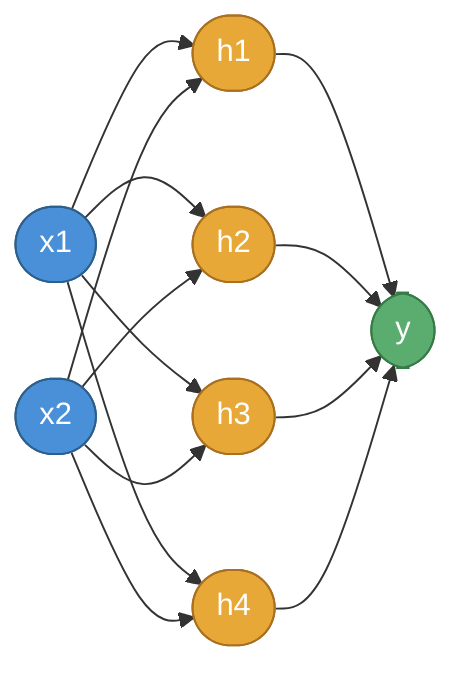

# Simple Neural Network from Scratch

A minimal implementation of a neural network with one hidden layer, designed to solve the XOR problem using only NumPy.

## Architecture



| Layer | Neurons | Activation |
|-------|---------|------------|
| Input | 2 | None |
| Hidden | 4 | Sigmoid |
| Output | 1 | Sigmoid |

- Loss Function: Mean Squared Error (MSE)
- Optimization: Gradient Descent with backpropagation

## XOR Problem

The XOR function is not linearly separable, requiring at least one hidden layer to solve.

| x1 | x2 | y |
|----|----|---|
| 0  | 0  | 0 |
| 0  | 1  | 1 |
| 1  | 0  | 1 |
| 1  | 1  | 0 |

## Files

- `nn.py` - Neural network implementation
- `xor_dataset.py` - XOR dataset generation
- `train.py` - Training script

## Usage

```bash
python3 train.py
```

## Training Configuration

| Parameter | Value |
|-----------|-------|
| Epochs | 10,000 |
| Learning rate | 0.8 |
| Hidden neurons | 4 |
| Seed | 42 |

## Mathematical Background

### Forward Pass

```
z1 = X . W1 + b1       a1 = sigmoid(z1)
z2 = a1 . W2 + b2      a2 = sigmoid(z2)
```

### Backward Pass

```
dL/dz2 = (a2 - y) * sigmoid'(z2)
dW2    = a1^T . dL/dz2 / m
dL/dz1 = (dL/dz2 . W2^T) * sigmoid'(z1)
dW1    = X^T . dL/dz1 / m
```

## Requirements

- Python 3.x
- NumPy

## License

MIT License
